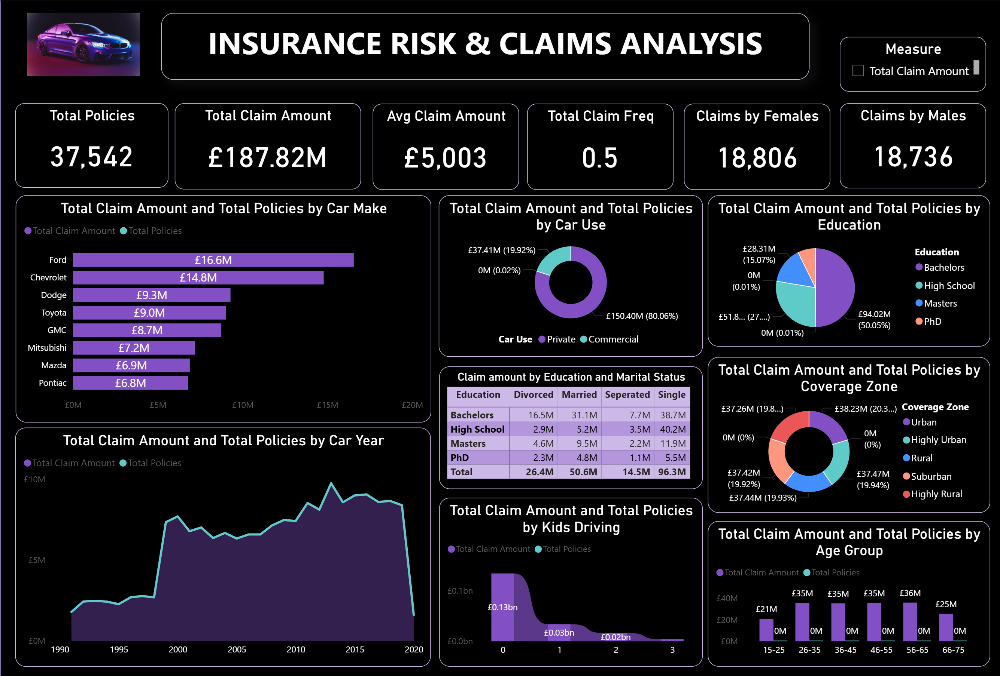

# 🚗 Insurance Risk & Claims Analysis Dashboard

## 📊 Project Overview
This is a demo Power BI dashboard that was developed to help an insurance company gain deeper insights into its policyholder base and claim patterns. The goal is to centralize fragmented data sources and provide stakeholders with a dynamic, interactive view of key performance indicators and risk factors.

## 🧩 Business Requirement
Insurance companies often struggle with siloed data, making it difficult to track performance and identify trends. This dashboard solves that by offering:

- A unified view of policy and claims data
- Interactive filtering and segmentation
- Visual storytelling through dynamic charts

## 🎯 KPI Highlights
The dashboard includes the following key metrics:
- **Total Policies** – Size of the active customer base
- **Total Claim Amount** – Financial impact of claims
- **Claim Frequency** – How often claims are made
- **Average Claim Amount** – Severity and risk exposure
- **Gender-wise Total Policies** – Customer segmentation by gender

## 📈 Visualizations
Each chart is designed to uncover patterns and support data-driven decisions:

| Visualization | Purpose |
|---------------|---------|
| **Donut Chart – Car Use** | Analyze policy distribution and claims by vehicle usage |
| **Bar Chart – Car Make** | Identify high-risk car brands |
| **Donut Chart – Coverage Zone** | Regional risk analysis |
| **Histogram – Age Group** | Claim frequency by age bracket |
| **Area Chart – Car Year** | Impact of vehicle age on claims |
| **Ribbon Chart – Kids Driving** | Influence of young drivers on risk |
| **Pie Chart – Education** | Correlation between education and insurance behavior |
| **Matrix Heat Grid – Education & Marital Status** | Combined demographic impact on claims |

## 📌 Features
- Dynamic filtering by policy attributes
- Drill-through capabilities for detailed analysis
- Clean, intuitive layout for stakeholder presentations

## 🖼️ Sample Dashboard Snippets
> *(Insert screenshots here with brief captions)*  
> Example:  
> 
> *Visualizing claim distribution by vehicle usage*

## 🛠️ Tools Used
- **Power BI** – Dashboard development
- **Excel / CSV** – Data preprocessing
- **DAX** – Calculated measures and dynamic filtering

## 📁 Folder Structure
```
/InsuranceDashboard
│
├── Insurance_policies_data
├── insurance_claims_analysis_dash.png
├── Insurance Risk and Claims Analysis.pbix
└── README.md
```

## 🚀 How to Use
1. Open the `.pbix` file in Power BI Desktop
2. Explore the dashboard using slicers and filters
3. Use drill-through to analyze specific customer segments
